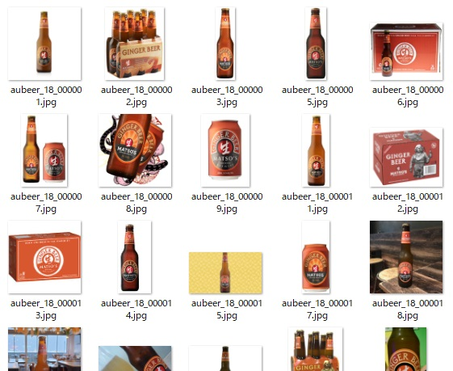
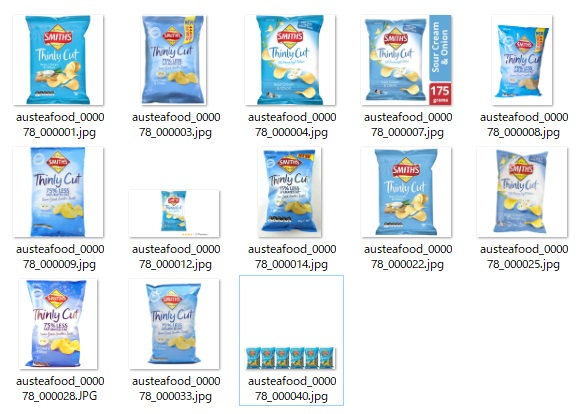
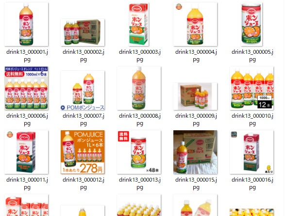
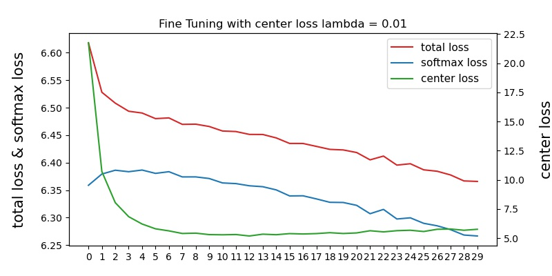
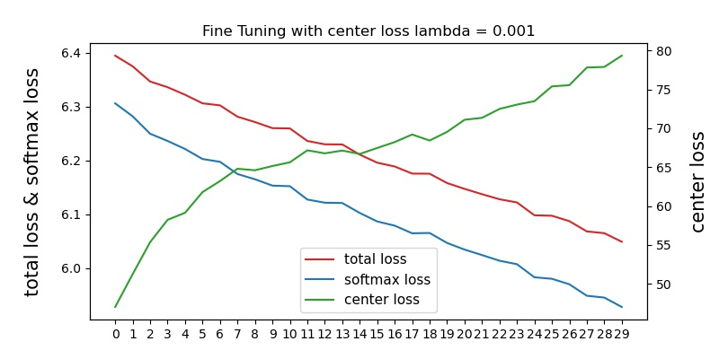
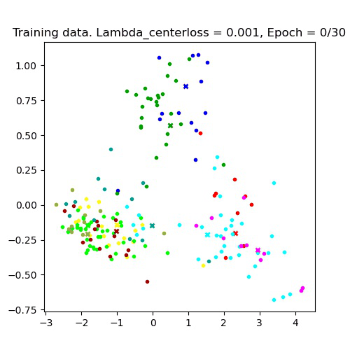
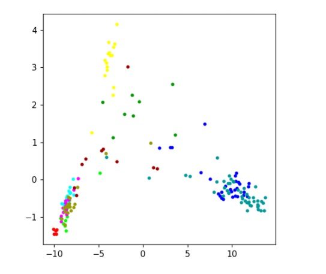
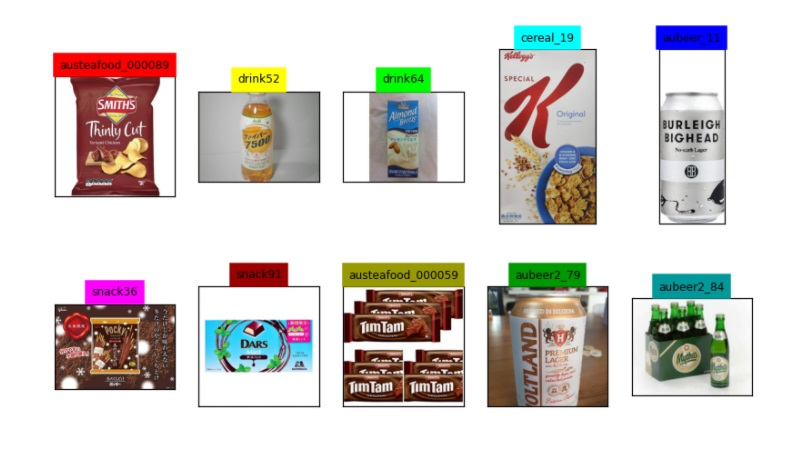
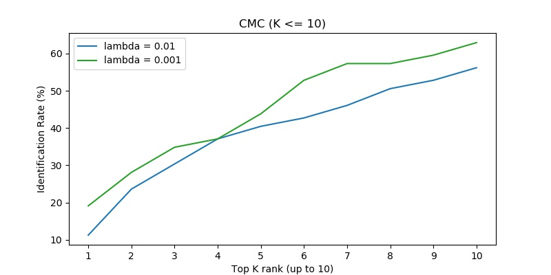
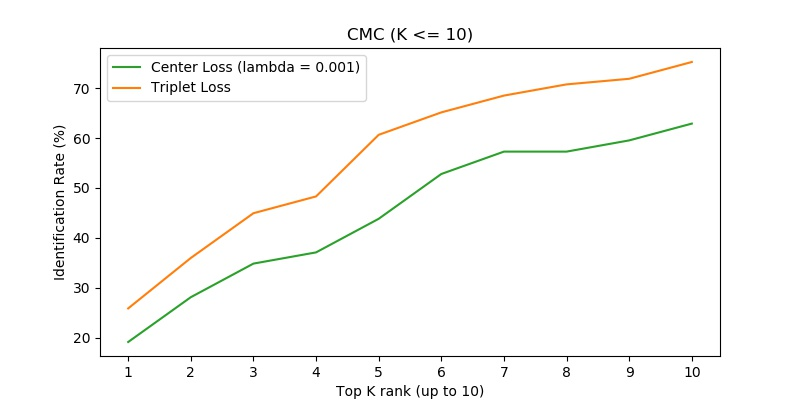

# Item Recognition with Center loss

This is my second **Item Recognition** experimental project. Previously I trained **a siamese network with triplet loss** to identify the image of food products (GitHub Repo: [TripletLoss_ItemRecognition](https://github.com/ChiekoN/TripletLoss_ItemRecognition)). For me it didn't achieve satisfying performance. This time I would like to try the technique which uses the combination of softmax loss and **center loss** as a loss function. This technique was originally proposed to improve face recognition tasks.

## Training and Test Data

The data set was exactly the same as what I used in the previous Triplet Loss project. Around 15000 images of food and drink products sold in Australia and Japan were collected on the internet. After some selection and dividing the dataset, the training data consists of 12070 images of 706 items, whereas the test data has 1447 images of 89 items.

In most cases, each item (class) includes a variety of looks. I sorted the images with different package designs or shapes into the same product as long as it has the same product name and the same flavour. Bottles, cans, bags, or boxes can be in the same class as a certain item. Sometimes it's quite confusing even from human's eyes.

**Example 1) MATSO'S GINGER BEER**

**Example 2) SMITHS Thinly Cut Sour Cream & Onion**

**Example 3) POM Juice**

## What is Center Loss?

According to [A Discriminative Feature Learning Approach for Deep Face Recognition](
https://ydwen.github.io/papers/WenECCV16.pdf):

Deep feature is the output of the second last layer, which is a fully connected layer. The distance between each sample point in the deep features and its corresponding class center is calculated, and the center loss is derived from them. The new centers are recalculated at every iteration as the deep features are updated.

 (*lambda*) is used for for balancing the two loss functions.   = 0 is equivalent to the normal softmax loss.

#### Reference about Center Loss

- Paper: [A Discriminative Feature Learning Approach for Deep Face Recognition](
https://ydwen.github.io/papers/WenECCV16.pdf)

- Paper: [Understanding Center Loss Based Network for Image Retrieval with Few Training Data](
https://openaccess.thecvf.com/content_ECCVW_2018/papers/11132/Ghosh_Understanding_Center_Loss_Based_Network_for_Image_Retrieval_with_Few_ECCVW_2018_paper.pdf)

- GitHub: [handongfeng/MNIST-center-loss](
https://github.com/handongfeng/MNIST-center-loss/blob/master/centerLoss_MNIST.py)

  I implemented the center loss layer and the related parts by referring to this GitHub, which helped me a lot!

## Architecture

Base Model is pretrained **InceptionV3**, which is followed by one global average pooling layer, one dropout, and two dense layers. The second dense layer connects to two output layers; one is the softmax layer and the other is the center loss layer.

## Training

I performed fine tuning method to train InceptionV3 pretrained model. First I made this base model untrainable and trained 20 epochs, then fine tuned in the following 30 epochs. Optimizer is SGD.

#### 1) Untrainable transfer learning:

Firstly I played around with some value of *lambda* with the pretrained model untrainable. I found that:

- `lambda = 0.01`: Most of the points in the deep features became tightly close to each other, looking like it's just one point in the plot at the end of the first epoch. It didn't seem it worked well in this situation.

- `lambda = 0.0007 to 0.003`: Better than `0.01`. But after around 10th epoch, center loss started to increase AND keep increasing while it was reasonably decreasing until that point. On the other hand, softmax loss kept decreasing throughout the training.

I finally chose `0.001` for the value of *lambda*.

#### 2) Fine tuning:

In fine tuning, the training proceeded more slowly. I tried `lambda = 0.01` and `lambda = 0.001`, and my final choice was the second one. At first I thought the first one seemed more reasonable because the **center loss** value decreased along with the softmax loss, whereas the center loss kept increasing with the other one. However, the model trained with `lambda = 0.001` actually made a better result in evaluation.

I plotted the transition of loss values below:

Below I show an animation of how the plot of deep features changed over epochs(Fine Tuning part). I selected the random 10 classes from the training data to monitor and plotted them during training. I can see that the points are spreading out in the larger space and are making distinctive groups over time.

## Evaluation

The test data set I used here contained 89 classes(items), none of which was used in training (It means the model was never trained to classify those items).

### Plot of Deep Features

I randomly selected 10 classes from test data, input the images under those classes to the model I trained (`center loss lambda = 0.001`), and extracted deep features of them.

The plot of deep features and corresponding sample images are shown blow.

In the plot, classes are not clearly separated, but I see some sort of categorisation.

#### CMC curve

As a metric, I used **CMC**(Cumulative Match Characteristics) and evaluate the model especially with top 1 to 10 ranking.

To evaluate the model, I selected one *representative image* per class. So there was 89 representative item images. Then I randomly selected one image from each class, which I called *target*. For each target, I calculated distances between it and each representative image based on the mapping of deep features, and picked the **top-K closest representative images**. I counted the number of cases where the representative image from the class the target belongs to was included in top K. The Identification Rate shown in the following plot is the percentage of those out of all 89 items.

I computed CMC for two models (*center loss lambda* is `0.01` and `0.001`). As shown in the plot above, the model with `center loss lambda = 0.001` performed better as I mentioned earlier.

#### Comparing to Triplet Loss

To compare this model to the previous Triple Loss model, I calculated CMC Rate for Triplet Loss model I trained before using the same test data set.

In this experiment, the Triplet Loss model overperformed the Center Loss model.

## Reflection

Unfortunately, I couldn't improve the performance of my item recognition model by employing center loss method. However, through this experiment, the experience of seeing the plot of deep features and evaluating CMC gave me a lot of insight about image classification in deep learning.

For further improvement,

- The model would improve if I used more training data. Generally in Face Recognition studies, millions of images are used.

- This task would be too challenging for the model because of the wide variety of examples in the same class as I mentioned earlier in "Training and Test Data" section. If I refine data so it has less variety (i.e. using only images with the same package design for a class, choosing only images of bottles for a drink, etc.), the model might achieve better performance with both center loss and triplet loss.

## Repository

**Notebooks:**
- `itemrecognition_centerloss_finetuning2.ipynb`:
   - In untrainable transfer learning, center loss lambda = 0.001
   - In fine tuning, **center loss lambda = 0.01**

- `itemrecognition_centerloss_finetuning3.ipynb`:
   - In untrainable transfer learning, center loss lambda = 0.001
   - In fine tuning, **center loss lambda = 0.001**

- `loss_plots.ipynb`: Plotting loss values from `history`

- `itemrecognition_centerloss_evaluate2.ipynb`: Evaluation of `itemrecognition_centerloss_finetuning2.ipynb`

- `itemrecognition_centerloss_evaluate3.ipynb`: Evaluation of `itemrecognition_centerloss_finetuning3.ipynb`

Data set and model files being output (`*.h5`) are not included in this repository because they are too large.
